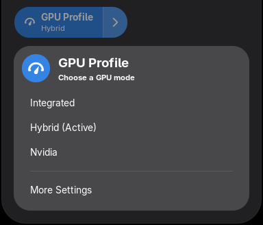
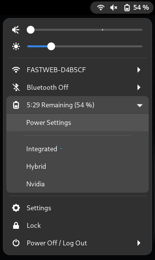

# GPU Profile Selector - GNOME Shell Extension

## Description
A GNOME Shell extension that provides an easy way to switch between GPU profiles on Nvidia Optimus systems (i.e. laptops with Intel + Nvidia or AMD + Nvidia configurations) in a few clicks.
This extension is a graphical interface for [envycontrol](https://github.com/bayasdev/envycontrol).

| GNOME 43+ (Quick Settings) | GNOME 42 or below (Top Bar) |
|:--:|:--:|
|  |  |

## Dependencies
- [pkexec](https://command-not-found.com/pkexec)
- [envycontrol](https://github.com/bayasdev/envycontrol) (make sure to have EnvyControl installed globally!)

## Installation

### GNOME Extensions website
- Install all the [dependencies](#dependencies)
- Enable extension in the official [GNOME Extensions](https://extensions.gnome.org/extension/5009/gpu-profile-selector/) store

### AUR
- AUR link: [gnome-shell-extension-gpu-profile-selector-git](https://aur.archlinux.org/packages/gnome-shell-extension-gpu-profile-selector-git)

### Manual
- Install all the [dependencies](#dependencies)
- Clone this repo:
  - GNOME 43 or above:
  ```
  git clone https://github.com/LorenzoMorelli/GPU_profile_selector.git ~/.local/share/gnome-shell/extensions/GPU_profile_selector@lorenzo9904.gmail.com
  ```
  - GNOME 42 or below:
  ```
  git clone --depth 1 --branch gnome-42-or-below https://github.com/LorenzoMorelli/GPU_profile_selector.git ~/.local/share/gnome-shell/extensions/GPU_profile_selector@lorenzo9904.gmail.com
  ```
- Compile the settings schema:
  ```
  glib-compile-schemas ~/.local/share/gnome-shell/extensions/GPU_profile_selector@lorenzo9904.gmail.com/schemas/
  ```

## Debugging and packaging

### Viewing logs
```
journalctl -f -o cat /usr/bin/gnome-shell
```

### Debugging with Wayland
- To show all messages:
```
export G_MESSAGES_DEBUG=all
```
- To set window size:
```
export MUTTER_DEBUG_DUMMY_MODE_SPECS=1366x768
```
- To open a new Wayland session in a window:
```
dbus-run-session -- gnome-shell --nested --wayland
```

### Compiling settings schema
```
glib-compile-schemas /path/to/extension/GPU_profile_selector@lorenzo9904.gmail.com/schemas/
```

### Packaging the extension for GNOME Extensions website
```
gnome-extensions pack GPU_profile_selector@lorenzo9904.gmail.com \
--extra-source="LICENSE" \
--extra-source="img" \
--extra-source="ui" \
--extra-source="lib"
```

## TODO
- Add setting to choose shell path.
- If restart prompt is canceled, then re-query the current state from envycontrol.
- Detect if envycontrol is not installed instead of prompting a restart popup in any case.
